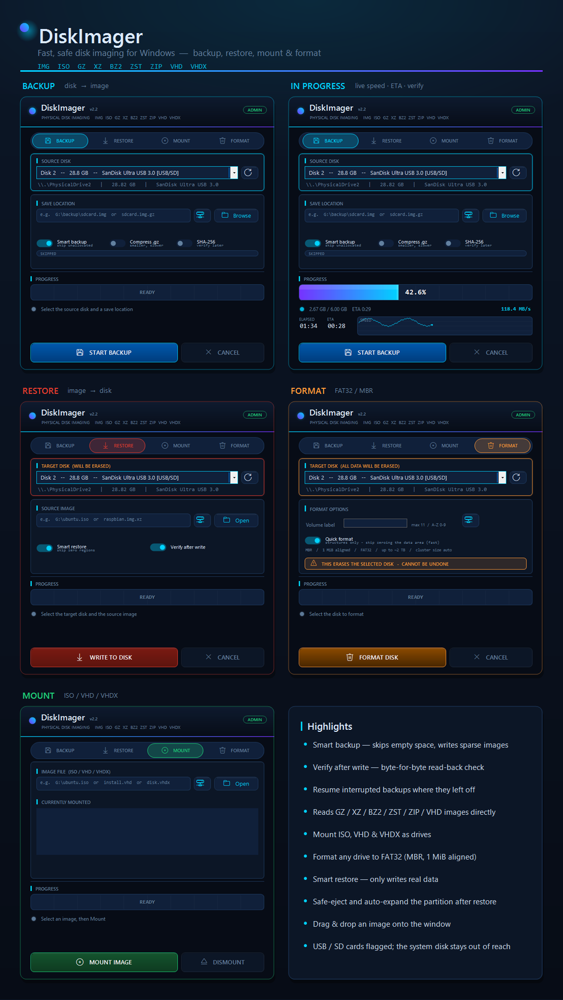
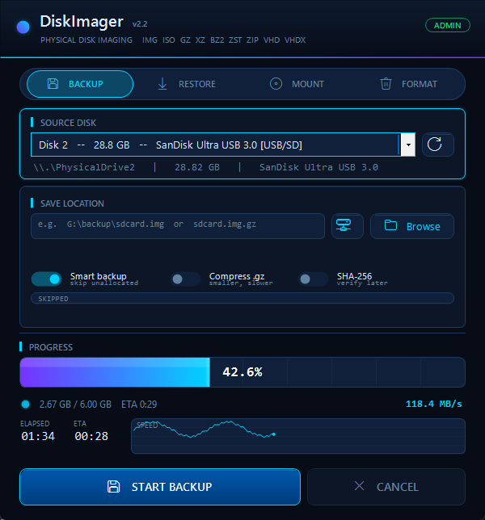

# DiskImager

**Fast, safe disk imaging for Windows.** Back up a USB stick or SD card to a file, write an image back to a disk, mount ISO/VHD files, or format a drive to FAT32 — all from one small app. No installer, no clutter.

---

## Download

1. Go to the [**Releases**](https://github.com/NookieAI/DiskImager/releases/tag/v1.0) page and download **`DiskImager.exe`**.
2. **Right-click → Run as administrator.** Raw disk access requires it — the app will tell you if it isn’t elevated.

It’s a single file. Nothing is installed, and nothing is left behind. Works on Windows 7 and later.

---

## The four modes

Pick a mode from the bar at the top of the window. The disk you choose is shown as `\\.\PhysicalDriveN` with its size and model, and removable drives are tagged **[USB/SD]** so they’re easy to spot.

### 💾 Backup — disk → image
Copy an entire disk to an image file.

1. Choose the **source disk**.
2. Click **Browse** and pick where to save (or type a path / drag a file in).
3. Click **START BACKUP**.

- **Smart backup** (on by default) copies only the parts of the disk that actually contain data and skips empty space, so the image is much smaller and faster to make. On an NTFS save drive the file is *sparse* — skipped areas take up no real space.
- **Compress** wraps the image in gzip (`.img.gz`) for an even smaller file.
- If a backup is interrupted, run it again to the same file and choose **Resume** to continue where it stopped.

### ⬇️ Restore — image → disk
Write an image back onto a disk (e.g. flashing a Raspberry Pi card or a bootable USB).

1. Choose the **target disk** — **everything on it will be erased.**
2. Click **Open** and pick the image (or drag it onto the window).
3. Click **WRITE TO DISK** and confirm.

- **Verify after write** re-reads every byte and compares it to the image, so you know the write was perfect.
- **Smart restore** skips the empty regions of a smart backup, so only real data is written.
- If the image is smaller than the disk, DiskImager can **expand the last partition** to fill the free space afterwards. Removable drives can be **safely ejected** when it’s done.

### 💿 Mount — ISO / VHD / VHDX
Open a disk image as a drive letter without writing anything.

1. Click **Open** and pick an `.iso`, `.vhd`, or `.vhdx` file.
2. Click **MOUNT IMAGE** — it appears as a new drive in Explorer.
3. Select it in the list and click **DISMOUNT** when finished.

### 🗑️ Format — FAT32
Wipe a drive and create a fresh FAT32 volume that works everywhere (Windows, macOS, Linux), with no size limit that Windows’ own formatter imposes.

1. Choose the **target disk** — **all data will be erased.**
2. Optionally set a **volume label** (up to 11 characters).
3. Click **FORMAT DISK** and confirm.

- **Quick format** (default) writes the filesystem structures in seconds. Turn it off for a full format that also zeroes the whole drive.

---

## While it runs

The progress bar shows the live percentage, and below it you get the **transfer speed, time elapsed, estimated time remaining**, and a real-time speed graph. Hit **Cancel** any time (already-written data is not rolled back).

---

## Supported image formats

| Format | Extension | Read (restore / mount) | Write (backup) |
|---|---|:---:|:---:|
| Raw image | `.img` `.bin` `.raw` | ✅ | ✅ |
| ISO 9660 | `.iso` | ✅ | — |
| gzip | `.gz` | ✅ | ✅ |
| XZ | `.xz` | ✅¹ | — |
| bzip2 | `.bz2` | ✅¹ | — |
| Zstandard | `.zst` | ✅¹ | — |
| ZIP | `.zip` | ✅ (first file) | — |
| VHD (fixed) | `.vhd` | ✅ | — |
| VHDX | `.vhdx` | mount only | — |

¹ XZ, bzip2 and Zstandard images need **[7-Zip](https://www.7-zip.org/)** installed. The format label warns you if it’s missing.

---

## Handy to know

- **Drag & drop** an image file anywhere onto the window to load it.
- **Keyboard:** `Enter` starts the current action · `Esc` cancels a running one · `F5` re-scans for disks.
- The **↺** button rescans after you plug in a new drive.
- When you pick an image, a label tells you the detected format and whether it’s ready to write.

---

## Safety

DiskImager writes directly to physical disks, so a wrong choice can erase the wrong drive. A few things keep you safe:

- **Restore** and **Format** always pop up a confirmation that names the exact disk (`\\.\PhysicalDriveN`), its size, and its model. Read it before clicking **Yes**.
- Removable drives are tagged **[USB/SD]** in the list so you can tell a memory card from a hard drive at a glance.
- Empty/zero-size drives are hidden, and the app never picks a disk for you — you’re always in control of the target.

> ⚠️ Backing up is harmless. **Restore and Format permanently erase the selected disk and cannot be undone.** Double-check the disk number, size, and model first.
